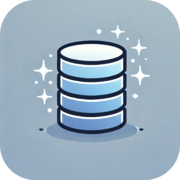

# Siimple ✨

Siimple is a lightweight, NoSQL database built for Flutter and Dart applications. It is designed to be simple, efficient, and easy to integrate into your projects. Perfect for offline-first apps or single-user environments.

> ⚠️ **Warning:** This package is not ready for production use yet. The API may change at any time.


```dart
import 'package:siimple/siimple.dart';

void main() async {
  // Initialize database
  WidgetsFlutterBinding.ensureInitialized();
  final dir = await getApplicationDocumentsDirectory();
  final db = Siimple(path: dir.path);
  await db.initialize();
  
  final todos = db.collection('todos');

  // Add some data
  await todoCollection.create({'text': 'Siimple is easy'});

  // Get all todos
  await todoCollection.query().findAll();

  // Get todos by some conditions
  await todoCollection.query()
    .where("text__contains", "t")
    .limit(5)
    .findAll();
}
```

Visit github repository and see example folder for more details.